<div align="center">
  

<a href="https://git.io/typing-svg"></a>

  <br />

  
  
  <br />
  <a href="#"></a>
  <a href="www.linkedin.com/in/mohamed-afnan"></a>
  <a href="mailto:infinityaffu@gmail.com"></a>
  <a href="https://github.com/mohamed-afnan-999"></a>
  <br />
</div>

---

## ✦ About Me

Computer Science undergraduate on track for a First Class degree, specializing in scalable systems architecture, AI/ML engineering, and full-stack development. Experienced in building production-grade data pipelines handling 1M+ records, proficient in modern backend frameworks, and passionate about open-source contribution.

I am an **undergrad CS student** on track for a **First Class degree** aspiring to be a **Software Engineer** and a **System Builder** with a deep focus on building highly scalable, distributed systems and integrating advanced **AI/ML** capabilities into production environments. 

I am passionate about experimenting 🧪 and tinkering 🛠️ everyday items to figure out how they work and make them quirky ✨. I am  building skills in backend system design & architecture and ML engineering.

- 🧠 **AI/ML Expertise:** Architecting predictive models, NLP pipelines, and LLM-driven applications with recent exposure to MCP-based agentic workflow development.
- ⚡ **Full Stack Development:** Designing robust microservices, resilient APIs, and high-performance systems with engaging UI/UX.
- 🏗️ **Product Engineering:** Translating complex business requirements into enterprise-grade technical solutions.


- 🎯 **Open To:** 
  - 💼 Summer 2027 internships (FAANG, FinTech, Deep Tech, Aerospace)
  - 🏢 September 2027 placement roles
  - 🤝 Open-source collaboration and AI research
  - 🌍 UK-based roles and international relocation
  - 👨‍💼Ambassadorships & Junior Dev/Engineering roles


---

## ✦ Tech Stack

### **Languages**<br/>
<a href="#"></a>

### **Frontend**<br/>
<a href="#"></a>

### **Backend & Databases**<br/>
<a href="#"></a>

### **Cloud, DevOps & Tooling**<br/>
<a href="#"></a>

---

## ✦ AI / ML Expertise

| Domain | Proficiency   | Details                                               |
| :--- |:--------------|:------------------------------------------------------|
| **Data Engineering** | Intermediate  | ETL pipelines, high-volume data processing            |
| **Data Analysis** | Intermediate  | Pandas, NumPy, statistical analysis, visualization |
| **Generative AI & LLMs** | Intermediate  | Fine-tuning, Model Context Protocol (MCP)             |
| **Prompt Engineering** | Intermediate+ | LLM fine-tuning, agents, multi-modal workflows |
| **Computer Vision** | Beginner      | Object Detection, Image Classification & Segmentation |
| **Natural Language Processing** | Experimenting | Upcoming                                              |

---

## 🚀 Featured Projects

<details>
<summary><b>1. ShadowQA - AI Quality Assurance Pipeline </b> <i>(Click to expand)</i></summary>
<br />
An automated Quality Assurance platform evaluating recruiter performance and regulatory compliance through advanced AI audio transcription and semantic analysis.

| Attribute | Details                                                                     |
| :--- |:----------------------------------------------------------------------------|
| **Stack** | React.js, Express.js, Node.js, Groq API, Llama 3.3, Whisper, MongoDB, MCP   |
| **Scale** | Concurrent chunk ingestion via Google Drive API                             |
| **Performance** | High-velocity transcription utilizing Groq LPU inference engines            |
| **Security** | Stateless Model Context Protocol (MCP) integration, secure HTTP streaming   |
| **Impact** | Eliminates manual QA auditing with zero-touch dynamic compliance injection  |
| **Repository** | [ShadowQA](https://github.com/mohamed-afnan-999/ShadowQA)                   |

*Professional Explanation:* Architected a distributed, multi-stage audio processing backend utilizing FFmpeg for media optimization and Groq's inference engine for rapid speech-to-text. Designed a dynamic React/MongoDB rule engine that injects QA criteria directly into Meta's Llama 3.3 context window via MCP, achieving semantic shadow reconstruction for one-sided audio recordings and autonomous compliance evaluation.
</details>

<details>
<summary><b>2. Komodo Hub - National Wildlife Conservation Platform </b> <i>(Click to expand)</i></summary>
<br />
A comprehensive full-stack educational and crowdsourcing platform designed to facilitate nationwide conservation efforts for Indonesia's endangered species.

| Attribute | Details                                                                        |
| :--- |:-------------------------------------------------------------------------------|
| **Stack** | Python, Flask, SQLAlchemy, JavaScript, SQLite, WebSockets                      |
| **Scale** | Multi-tenant architecture supporting Schools, Communities, and Citizens        |
| **Performance** | Real-time bi-directional chat & async background task processing               |
| **Security** | Granular Role-Based Access Control (RBAC), bcrypt hashing, CSRF protection     |
| **Impact** | Centralized sightings database, interactive gamification, and virtual learning |
| **Repository** | [Komodo Hub](https://github.com/mohamed-afnan-999/Komodo-Hub)                  |

*Professional Explanation:* Co-engineered a resilient, scalable application using Flask and SQLAlchemy, implementing strict Role-Based Access Control (RBAC) to securely isolate student environments from public knowledge bases. Integrated Flask-SocketIO for real-time community chat telemetry and developed a dynamic content management system supporting interactive courses, wildlife sighting logs, and automated assignment tracking.
</details>

<details>
<summary><b>3. IoT Smart Agriculture Monitoring System </b> <i>(Click to expand)</i></summary>
<br />
A distributed, low-latency IoT network for automated crop health monitoring, multi-sensor irrigation management, and environmental telemetry.

| Attribute | Details                                                            |
| :--- |:-------------------------------------------------------------------|
| **Stack** | Python, MQTT, Adafruit IO, paho-mqtt, IoT Sensors (DHT22, MQ135)   |
| **Scale** | Real-time concurrent ingestion from diverse multi-sensor nodes     |
| **Performance** | Sub-second MQTT message brokering and payload decoding             |
| **Security** | Authenticated pub/sub channels via encrypted Adafruit IO instances |
| **Impact** | Automated actuator response based on predictive thresholds         |
| **Repository** | [Smart Agriculture Monitoring System](https://github.com/mohamed-afnan-999/Smart-Strawberry-Farm-Monitoring-System)                            |

*Professional Explanation:* Engineered a distributed event-driven architecture utilizing the MQTT protocol to bridge physical sensors (moisture, pH, CO2, temperature) with cloud-based visualization dashboards. Implemented autonomous actuator logic in Python to trigger physical hardware interventions (servos, pumps, sprinklers, acid/lime injectors) in real-time, optimizing resource efficiency and maintaining strict environmental compliance boundaries.
</details>

<details>
<summary><b>4. US Mobility Analysis ML Pipeline </b> <i>(Click to expand)</i></summary>
<br />
A data science pipeline analyzing continental-scale mobility data, comparing sequential and parallel computing architectures to optimize predictive ML models.

| Attribute | Details                                                                                            |
| :--- |:---------------------------------------------------------------------------------------------------|
| **Stack** | Python, Dask, Pandas, Scikit-Learn, Matplotlib                                                     |
| **Scale** | Processed 1M+ national trip records continuously                                                   |
| **Performance** | Reduced memory footprint by 28% via parallel chunking                                              |
| **Security** | Data sanitization and null-value median imputation                                                 |
| **Impact** | Built highly optimized travel frequency prediction models (R² ~0.89)                               |
| **Repository** | [Machine Learning Pipeline](https://github.com/mohamed-afnan-999/US-Mobility-Analysis-ML-Pipeline) |

*Professional Explanation:* Architected a parallelized data science pipeline utilizing Dask to process large-scale geographic mobility datasets across multi-core clusters. Engineered automated data imputation, memory footprint optimization, and linear regression models to accurately predict trip frequencies, visually benchmarking parallel versus serial execution efficiency.
</details>

---

## 💼 Experience

### **Backend Systems & AI Integration Engineer Intern** | Operate Live (OPC) Pvt. Ltd. | Summer Internship
**June 2026 – Present** | **Bangalore, India (Hybrid)**

Architected and deployed an enterprise-grade automated QA compliance pipeline, called [ShadowQA](https://github.com/mohamed-afnan-999/ShadowQA), utilizing the Model Context Protocol (MCP) and Generative AI to evaluate recruiter performance.

- **AI Orchestration & Prompt Engineering:** Implemented "Semantic Shadow Reconstruction" using Meta's Llama 3.3 to accurately infer missing conversational context and candidate responses from one-sided audio recordings.
- **Protocol Integration:** Engineered a stateless Node.js and Express backend utilizing HTTP Streaming and the Model Context Protocol (MCP) to securely expose complex audio-processing tools to external AI agents.
- **Media Processing Pipeline:** Developed a fail-safe, concurrent media ingestion pipeline utilizing Axios and FFmpeg to stitch and down-sample audio streams, optimizing payloads for high-speed Whisper transcription.
- **Database & Full-Stack Architecture:** Integrated MongoDB Atlas with connection pooling to manage dynamic compliance rulesets, rendering real-time audit telemetry and results to a React.js frontend.

> `Node.js` `Express.js` `React.js` `MongoDB` `Model Context Protocol (MCP)` `Groq LPU` `Llama 3.3` `Whisper-v3` `FFmpeg`

---

## ✦ Coding Profiles

<div align="center">
  <a href="https://leetcode.com/u/Infinity_99/"></a>
  <a href="https://www.hackerrank.com/profile/infinityaffu"></a>

</div>

---

## ✦ GitHub Analytics

<div align="center">
  
  
  <br/>
  <br/>
  
</div>

---

## ✦ Contribution Activity

<div align="center">
  
</div>

---
## ✦ Contribution Snake

<div align="center">
  <picture>
    <source media="(prefers-color-scheme: dark)" srcset="https://raw.githubusercontent.com/mohamed-afnan-999/mohamed-afnan-999/output/github-contribution-grid-snake-dark.svg">
    <source media="(prefers-color-scheme: light)" srcset="https://raw.githubusercontent.com/mohamed-afnan-999/mohamed-afnan-999/output/github-contribution-grid-snake.svg">
    
  </picture>
</div>

---

## ✦ Current Focus

```yaml

Current_Status:

  Learning:

    - "Advanced Python for Machine Learning Engineering"

    - "Express.js Backend Systems Development and System Architecture"
    
    - "Advanced Git and GitHub Actions workflows"
    
    - "Docker" 

  Building:

    - "Neural Networks and Image Classification ML Model"

    - "Production System-Level Full-Stack App"

  Exploring:

    - "Agentic workflows using LLMs"

    - "Agentic AI Systems with MCP Server"

  Open_To:

    - "Junior backend architecture & ML Engineer roles"
    
    - "Hackathons and Live Build Challenges" 

    - "Collaborations on scalable open-source tooling"
    

```


